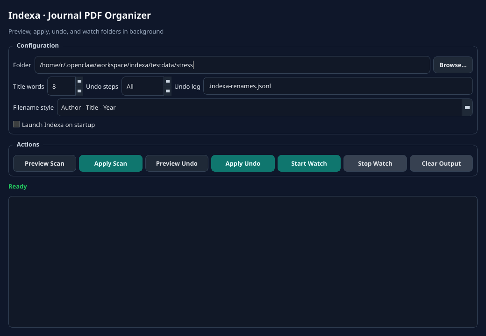
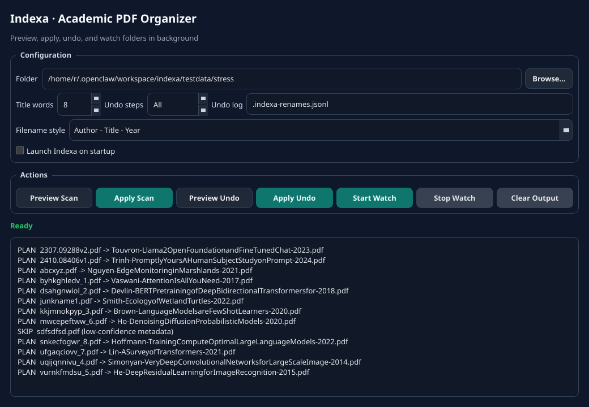

# Indexa

Auto-rename downloaded journal PDFs using a canonical filename format:

`FirstAuthor-ShortTitle-Year.pdf`

## Why we built this

This came from a very real pain point [@Tharusha-W](https://github.com/Tharusha-W) kept running into while downloading and organizing academic papers for research:

> “Why do I have to type this out every single time? There has to be a more efficient way.”

Short filenames like `FirstAuthor et al. (Year)` are fast in the moment, but later you end up reopening files just to find the exact title when you want to share them.

Adding full titles helps, but then every download turns into another tiny manual task.  
And yeah… ain’t nobody got time for that.

That constant friction is exactly why Indexa exists:  
**download PDF → auto-name it cleanly → move on.**

## What it does

- Scans a folder for PDFs
- Extracts metadata from embedded PDF fields first
- Falls back to text extraction + DOI lookup via Crossref
- Renames files safely (collision-aware)
- Supports dry-run mode
- Writes an undo log for all applied renames
- Optional watch mode for continuously renaming new downloads

## Quick start

```bash
python -m venv .venv
source .venv/bin/activate
pip install -r requirements.txt
```

## GUI (recommended)

Run:

```bash
python -m indexa.gui
```

GUI includes:
- folder picker
- preview/apply scan
- preview/apply undo
- start/stop watch mode
- system tray support (minimize to tray)
- Windows autostart toggle (Run key)
- simple filename style presets + advanced custom template
- title-word / interval / undo-log controls

### GUI screenshots




## Windows packaging / release

We ship **both** Windows package types via GitHub Actions:

- **Portable:** `Indexa-windows-portable.zip`
- **Installable:** `Indexa-Setup.exe` (Inno Setup)

Workflow: `.github/workflows/windows-release.yml`

Trigger options:
- manual: Actions → **Windows Release** → Run workflow
- release tag: push `v*` tag (e.g. `v0.1.0`)

Tag release flow:

```bash
git tag v0.1.0
git push origin v0.1.0
```

After CI completes, download both files from workflow/release assets.

## CLI

### Scan once

```bash
# preview
python -m indexa.cli scan ~/Downloads/indexa-test --dry-run

# apply
python -m indexa.cli scan ~/Downloads/indexa-test --apply
```

### Watch folder continuously

```bash
python -m indexa.cli watch <folder> --apply
```

Uses event-driven file watching (`watchdog`) + stable-file checks by default.
If watchdog is unavailable, it falls back to interval polling (`--interval`, default 3s).

Stop with `Ctrl+C`.

### Undo renames

```bash
# Preview undo for all logged renames
python -m indexa.cli undo <folder> --dry-run

# Undo last 5 renames
python -m indexa.cli undo <folder> --steps 5 --apply

# Undo all renames in the log
python -m indexa.cli undo <folder> --apply
```

## Filename rule

Default template:

`{first_author_last}-{short_title}-{year}.pdf`

Template tokens:
- `{first_author_last}`
- `{short_title}`
- `{year}`

The `--title-words` flag controls how many title words are kept (default: `8`).

Sanitization removes filesystem-hostile characters and truncates long tokens.
