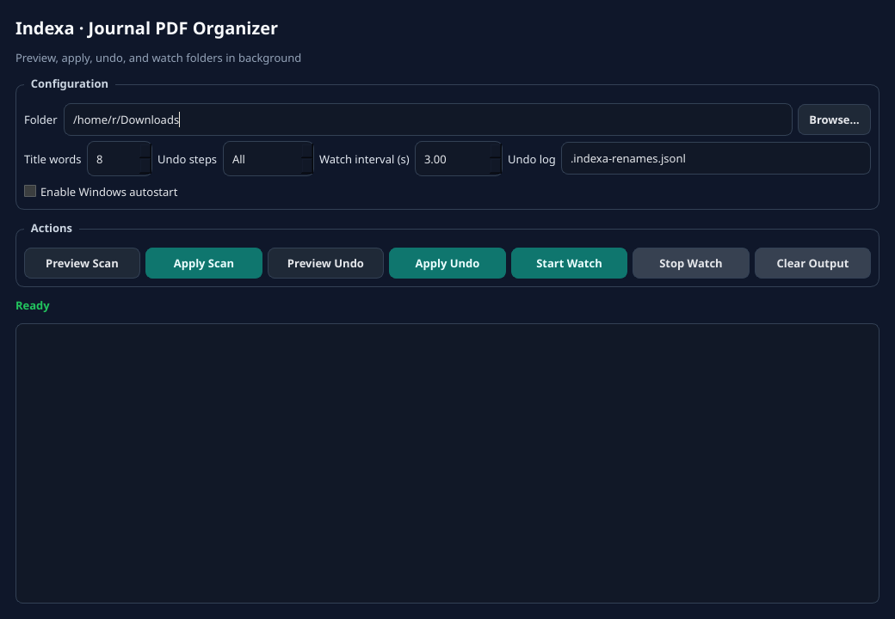

# Indexa

Auto-rename downloaded journal PDFs using a canonical filename format:

`FirstAuthor-ShortTitle-Year.pdf`

## What it does

- Scans a folder for PDFs
- Extracts metadata from embedded PDF fields first
- Falls back to text extraction + DOI lookup via Crossref
- Renames files safely (collision-aware)
- Supports dry-run mode
- Writes an undo log for all applied renames
- Optional watch mode for continuously renaming new downloads

## Quick start

```bash
python -m venv .venv
source .venv/bin/activate
pip install -r requirements.txt

# Preview
python -m indexa.cli scan ~/Downloads/indexa-test --dry-run

# Apply renames
python -m indexa.cli scan ~/Downloads/indexa-test --apply
```

## GUI (PySide6)

```bash
pip install -r requirements.txt
python -m indexa.gui
```

### Screenshots




GUI includes:
- folder picker
- preview/apply scan
- preview/apply undo
- start/stop watch mode
- system tray support (minimize to tray)
- Windows autostart toggle (Run key)
- title-word / interval / undo-log controls

## Commands

### 1) Scan once

```bash
python -m indexa.cli scan <folder> [--apply] [--title-words 8] [--undo-log .indexa-renames.jsonl]
```

### 2) Watch folder continuously

```bash
python -m indexa.cli watch <folder> --apply --interval 3
```

Stop with `Ctrl+C`.

### 3) Undo renames

```bash
# Preview undo for all logged renames
python -m indexa.cli undo <folder> --dry-run

# Undo last 5 renames
python -m indexa.cli undo <folder> --steps 5 --apply

# Undo all renames in the log
python -m indexa.cli undo <folder> --apply
```

## Filename rule

Default template:

`{first_author_last}-{short_title}-{year}.pdf`

The `--title-words` flag controls how many title words are kept (default: `8`).

Sanitization removes filesystem-hostile characters and truncates long tokens.
